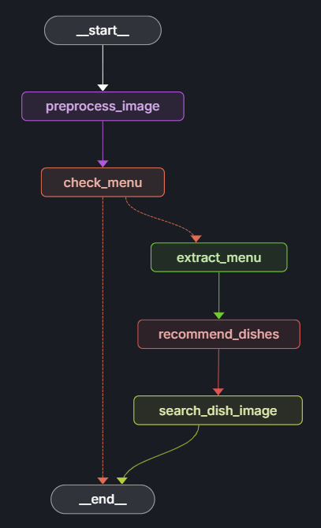

# DishDecode

Unlock the future of dining discovery with DishDecode! Whether you’re a foodie traveler, a restaurant owner looking to elevate the guest experience, or just someone who’s ever stared at a foreign menu in confusion, DishDecode is your ultimate companion. 

Snap a photo of any menu—anywhere in the world—and let our powerful app do the rest. DishDecode instantly translates and decodes menu items, recommends top-rated dishes, and even shows you mouthwatering images so you know exactly what to expect.
No more guessing games. No more menu anxiety. Just smarter, tastier decisions—served up in seconds.

**Note: Currently, DishDecode supports only menus written in Korean.**

DishDecode is an intelligent app built on a modular, graph-based workflow powered by LangGraph and LangChain. It integrates LLMs and image processing to deliver end-to-end menu understanding.

## Features
- **Image preprocessing**: Resizes and prepares menu images for analysis.
- **Menu detection**: Determines if an image contains a menu.
- **Menu extraction**: Extracts dish names from menu images.
- **Dish recommendation**: Suggests dishes based on the extracted menu.
- **Dish image search**: Finds images of recommended dishes.

## Architecture

The workflow is defined in `src/dishdecode/graph.py`. Nodes are implemented in `src/dishdecode/nodes.py`. The pipeline is as follows:

## Node Descriptions

- **preprocess_image**: Resizes and saves the processed image.
- **check_menu**: Determine if the image contains a menu.
- **extract_menu**: Extracts structured menu data from the image.
- **recommend_dishes**: Recommends dishes based on menu data.
- **search_dish_image**: Searches for images of recommended dishes.

